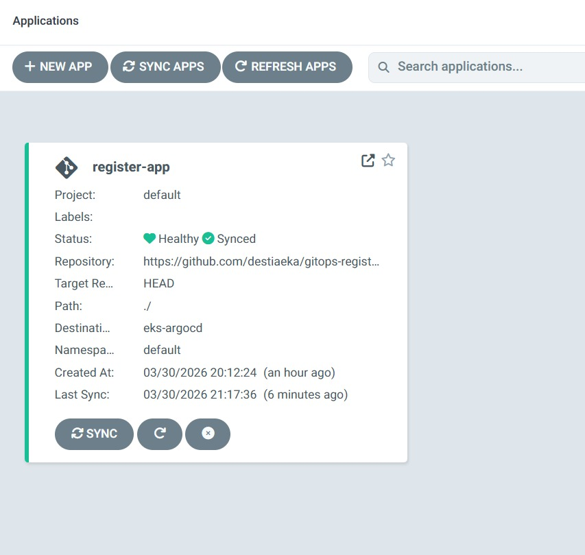
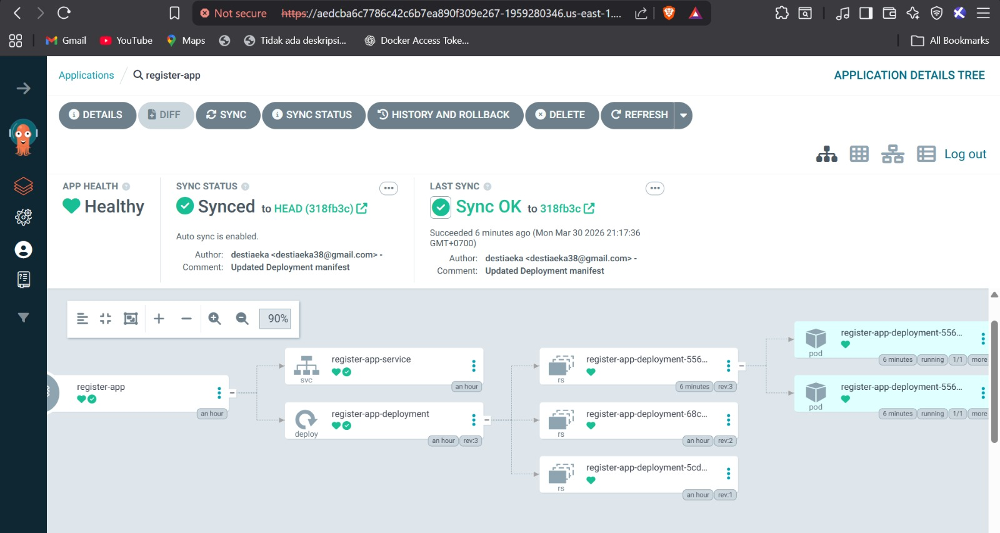
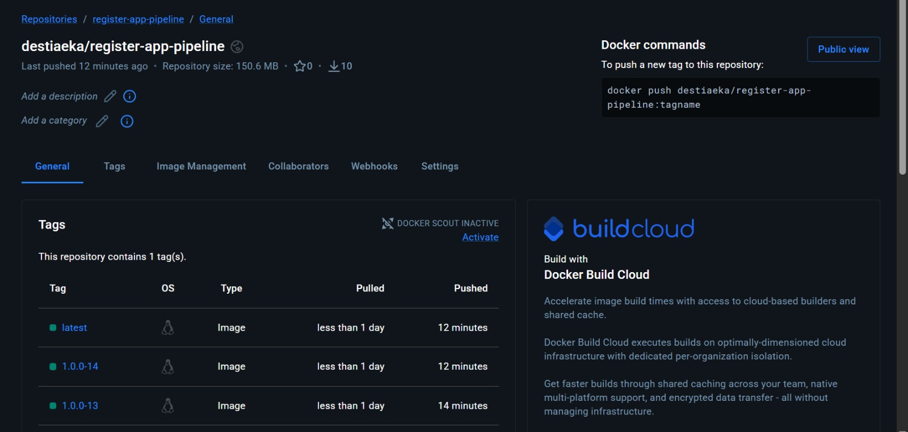
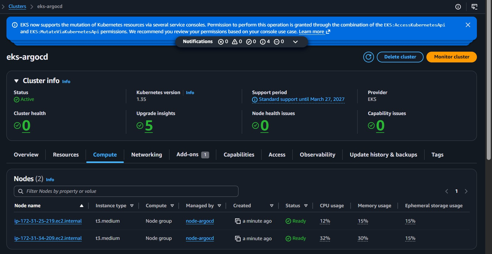
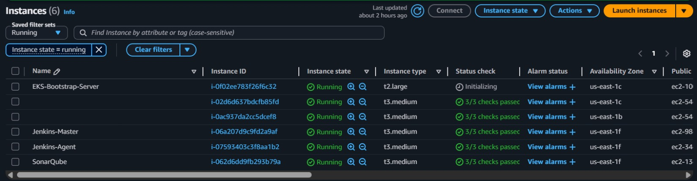
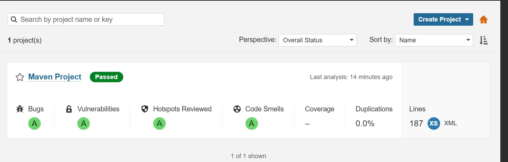
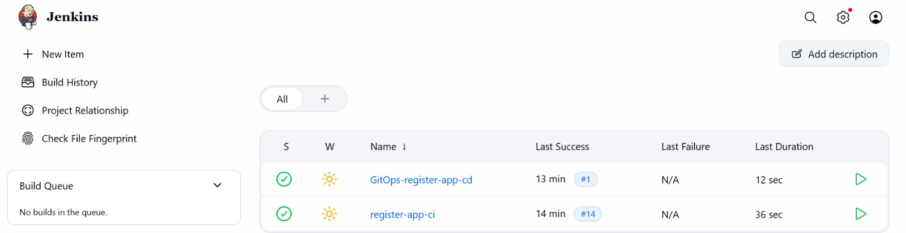
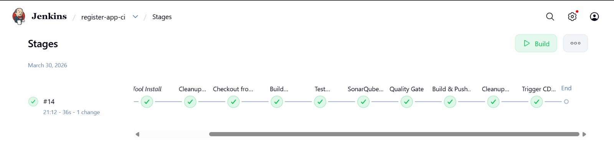
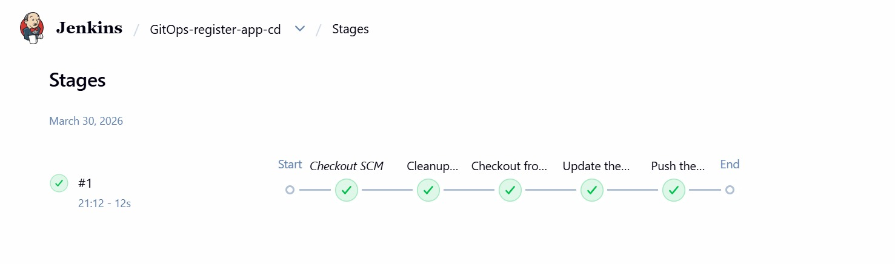
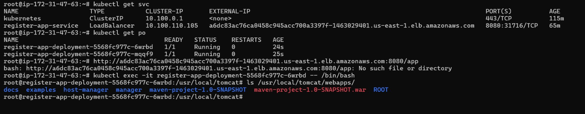

# Architechture Diagram

# Project Output Snips 

Read complete setup article here: https://dev.to/msfaizi/real-time-devops-project-deploy-to-kubernetes-using-jenkins-end-to-end-devops-project-cicd-3eh3.

